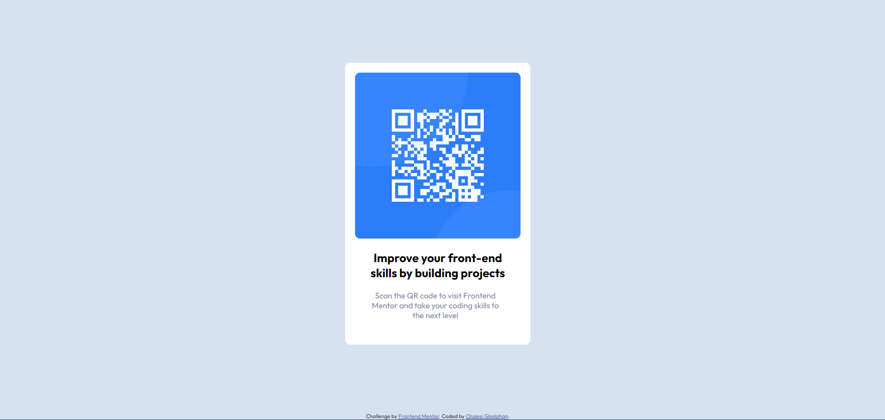

# Frontend Mentor - QR code component solution

This is a solution to the [QR code component challenge on Frontend Mentor](https://www.frontendmentor.io/challenges/qr-code-component-iux_sIO_H).

## Overview

### Screenshot

### Links

- Solution URL: [Add solution URL here](https://github.com/olusesimrg/qr-code-component.git)
- Live Site URL: [Add live site URL here](https://olusesimrg.github.io/qr-code-component/)

## My process

### Built with

- Semantic HTML5 markup
- CSS custom properties
- Flexbox

## Author

- Frontend Mentor - [@Olusesimrg](https://www.frontendmentor.io/profile/olusesimrg)
- Twitter - [@olusesimrgee](https://www.twitter.com/olusesimrgee)

